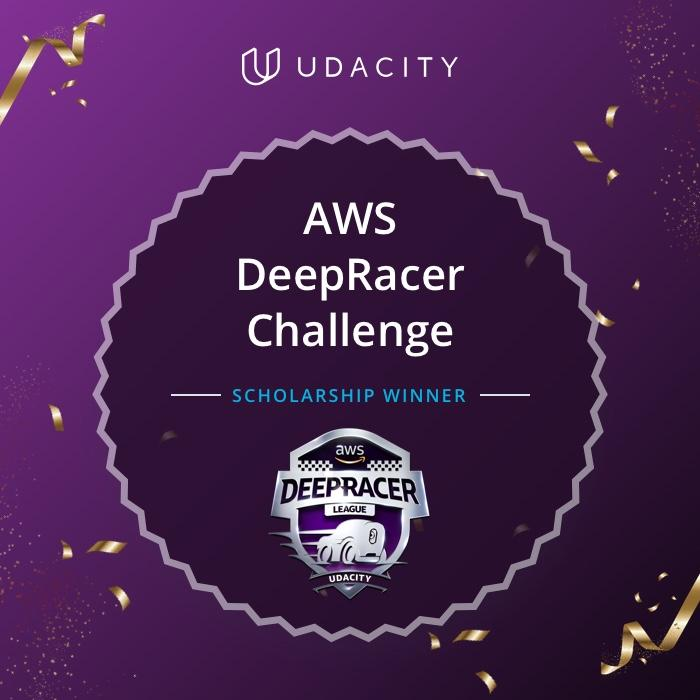

# Machine Learning Engineer Nanodegree Projects

  

A collection of projects for the Machine Learning Engineer Nanodegree from Udacity [AWS DeepRacer Challenge Scholarship].

## [Project 1: Deploy a Sentiment Analysis Model](https://github.com/suryasanchez/machine-learning-engineer-nanodegree/tree/master/P1-sentiment-analysis)

Sentiment Analysis Web App is a notebook and collection of Python files. It is a deployed RNN performing sentiment analysis on movie reviews complete with publicly accessible API and a simple web page which interacts with the deployed endpoint.